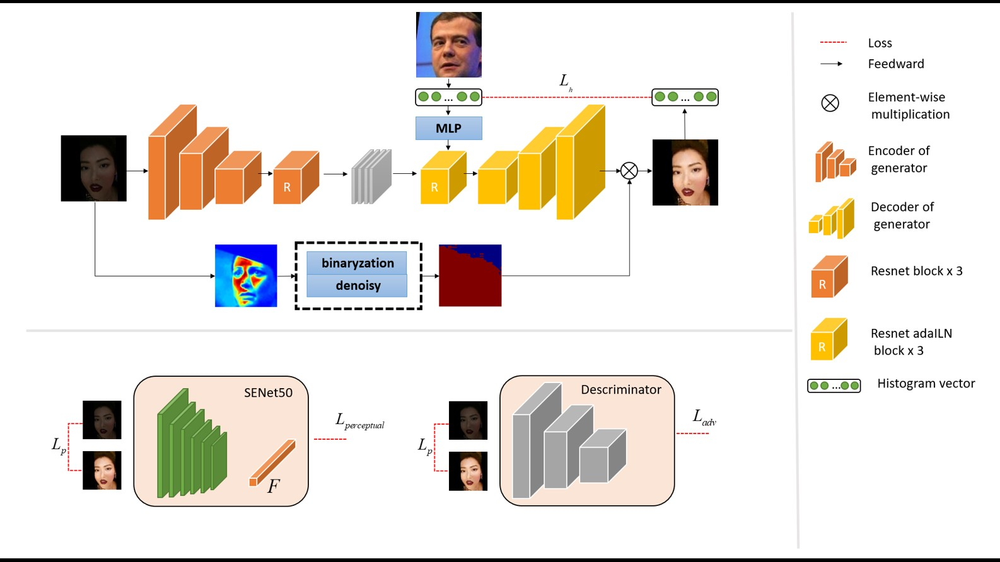

<div align="center">  </div>
<div align="center">  </div>

# Unsupervised Face Illumination Enhancement in the Wild

This repository contains training code for the project.

Unsupervised Face Illumination Enhancement in the Wild.

The model learns to brighten dark faces in the wild, aiming to obtain a better visual effects and improve the accuracy of face recognition.
 
Contact: Zhuo Wang (1048727525@qq.com)

## Usage

### Prerequisites
- Python 3.x
- Pytorch 1.1.0 or higher, torchvision 0.3.0 or higher
- 

### Prepare Datasets

We used [CASIA-Webface](http://www.cbsr.ia.ac.cn/english/CASIA-WebFace-Database.html)  for norm illumination face set and [Million-Celebs](Zhang Y , Deng W . Class-Balanced Training for Deep Face Recognition[C]// 2020 IEEE/CVF Conference on Computer Vision and Pattern Recognition Workshops (CVPRW). IEEE, 2020.) for dark face set in the unconstrained experiment. We can not redistribute the original dataset due to copyright. For normal face set, you can use other public-available datasets that has highly-normalled faces.

All face images are detected by [MTCNN](https://github.com/kpzhang93/MTCNN_face_detection_alignment), and then cropped.

## Pretrained models

* ([IR-SE50 @ BaiduNetdisk](https://pan.baidu.com/s/12BUjjwy1uUTEF9HCx5qvoQ))
* ([IR-SE50 @ Onedrive](https://1drv.ms/u/s!AhMqVPD44cDOhkPsOU2S_HFpY9dC))
* ([Mobilefacenet @ BaiduNetDisk](https://pan.baidu.com/s/1hqNNkcAjQOSxUjofboN6qg))
* ([Mobilefacenet @ OneDrive](https://1drv.ms/u/s!AhMqVPD44cDOhkSMHodSH4rhfb5u))

### Train and test

- Train

After unnormal face images and normal face images are ready, prepare image list respectively.
Modify image path and list path and other settings in **config.py**.
```
python main.py
```
- Test
```
python test.py --test_path your_test_path --test_list your_test_list --checkpoint_ft pretrained_model_path
```

