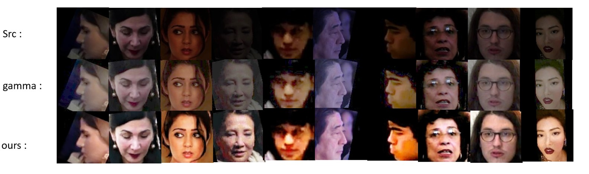

<div align="center">  </div>

# Unsupervised Low-light Face Image Enhancement in the Wild

This repository contains training code for the project.

Unsupervised Low-light Face Image Enhancement in the Wild.

The model learns to brighten dark faces in the wild, aiming to obtain a better visual effects and improve the accuracy of face recognition.
 
Contact: Zhuo Wang (1048727525@qq.com)

## Usage

### Prerequisites
- Linux or macOS
- CPU or NVIDIA GPU + CUDA CuDNN
- Python 3.x
- Pytorch 1.1.0 or higher, torchvision 0.3.0 or higher
- Other dependencies

### Installation
- Clone this repo:
```
git clone https://github.com/1048727525/FIE
cd FIE
```

- Install PyTorch and other dependencies:
   - For pip users, please type the command `pip install -r requirements.txt`.
   - For Conda users, you can create a new Conda environment using `conda env create -f environment.yml`.

### Prepare Datasets

We used [CASIA-Webface](http://www.cbsr.ia.ac.cn/english/CASIA-WebFace-Database.html)  for normal illumination face set and [Million-Celebs](https://openaccess.thecvf.com/content_CVPRW_2020/papers/w48/Zhang_Class-Balanced_Training_for_Deep_Face_Recognition_CVPRW_2020_paper.pdf) for low-light face set in the unconstrained experiment. We can not redistribute the original dataset due to copyright. For normal face set, you can use other public-available datasets that has highly-normalled faces.

All face images are detected by [MTCNN](https://github.com/kpzhang93/MTCNN_face_detection_alignment), and then cropped.

### Pretrained models

* [IR-SE50 @ BaiduNetdisk](https://pan.baidu.com/s/12BUjjwy1uUTEF9HCx5qvoQ)
* [IR-SE50 @ Onedrive](https://1drv.ms/u/s!AhMqVPD44cDOhkPsOU2S_HFpY9dC)
* [Mobilefacenet @ BaiduNetDisk](https://pan.baidu.com/s/1hqNNkcAjQOSxUjofboN6qg)
* [Mobilefacenet @ OneDrive](https://1drv.ms/u/s!AhMqVPD44cDOhkSMHodSH4rhfb5u)

### Train and test
After low-light face images and normal illumination face images are ready, and are placed like this (A: Low-light face, B: normal illumination face):
```
├── dataset
   └── YOUR_DATASET_NAME
       ├── trainA
           ├── xxx.jpg (name, format doesn't matter)
           ├── yyy.png
           └── ...
       ├── trainB
           ├── zzz.jpg
           ├── www.png
           └── ...
       ├── testA
           ├── aaa.jpg 
           ├── bbb.png
           └── ...
```
- Train
```
CUDA_VISIBLE_DEVICES='0' python -u main.py --dataset YOUR_DATASET_NAME --result_dir YOUR_RESULT_NAME
```
- Test
```
CUDA_VISIBLE_DEVICES='0' python -u main.py --dataset YOUR_DATASET_NAME --result_dir YOUR_RESULT_NAME --phase test
```

